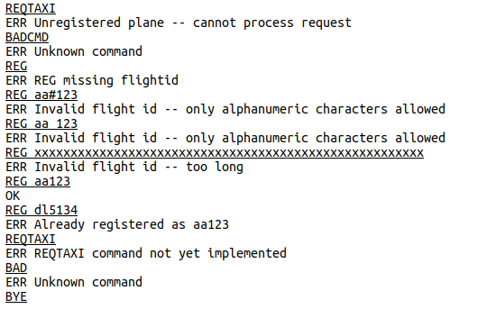

## High-Level Project Overview

This project is an air traffic "ground
control" server, that tracks airplanes on the ground at an airport,
and grants permission for planes to taxi and takeoff. The basic way
this operates is that each airplane is a network client that connects
to the server you are writing, and the server handles commands and
requests from the planes. The full application-level protocol is defined in the final section of this README.

**Important:** The server is *not* a program that interacts with a
human user. While that's the way it is tested, the design is for a
server program that talks with *client programs* in the planes. What
this means is that the communication is *EXACTLY* as defined
below in the section "Application Layer Protocol".



## The Application Layer Protocol

The air traffic server uses a line-based application-layer network
protocol. Airplanes connect to the server, and messages from the
airplane to the controller and from the controller to the airplane are
single lines of text. An airplane can make a request (e.g., ask to
taxi from the terminal) using a line in which the first word is a
command possibly with some optional arguments as described below.  The
status of an airplane, and all the data necessary for communication
between the server and the airplane, is in the `airplane` data type,
defined in `airplane.h`. The provided structure definition has
everything you need for Part 1 of the assignment, but you might need
to add additional fields for later parts.

At any point in time, every airplane that is part of the system has a
current state, which is one of six possible values. These values are
defined in `airplane.h` and the current state for each airplane in the
`state` field of the `airplane` structure. The states are as follows:

* `PLANE_UNREG` - the initial state of a plane when it contacts ground
  control, meaning that the plane is unregistered and parked at the
  terminal. A plane must register and give a flight number/id before
  any other command will be accepted.

* `PLANE_DONE` - this is a special state in which the airplane has
  indicated that it is done interacting with ground control, either
  because it has taken off (and air control will take over) or it is
  parked at the terminal and doesn't want to interact any more.

* `PLANE_ATTERMINAL` - this is the state of a plane that has
  registered with ground control (so has a flight number) but is still
  parked at the terminal.

* `PLANE_TAXIING` - this is the state of a plane that has requested
  permission to taxi, and has received that permission from ground
  control.

* `PLANE_CLEAR` - this is the state of a plane that has reached the
  front of the taxi list, and has been cleared to take off.

* `PLANE_INAIR` - this is the state of a plane that has taken off. A
  plane in this state will transition to the `PLANE_DONE` state
  automatically.

There are six commands or requests that an airplane can send to ground
control. Each command is sent on a single line from the airplane to
the server, with a command *exactly* as listed below (including
capitalization) and any necessary arguments on the same line separated
by at least one space from the command. When the server receives a
command, it will always respond with either "OK" on a line by itself,
or if there is something wrong with the command then the server
responds with a line beginning with "ERR", followed by a space and a
single-line free-form (human understandable) description of the
error. For example, if the airplane issues the command "REG aa#123"
then the server could respond with

```
ERR Invalid flight id -- only alphanumeric characters allowed
```

Here is a complete list of commands that the airplane can send to
ground control:

* `REG flightid` \
  Register the plane as a given "flightid", where flightid is a unique
  identifier for the airplane (like aa1534). "flightid" must be a
  single word (no spaces) consisting of only alphanumeric
  characters. It can be at most `PLANE_MAXID` characters long (defined
  in `airplane.h`). A command with a missing or invalid flightid must
  be rejected by the server as an error. This command can only be
  issued if the airplane is in the `PLANE_UNREG` state, and success
  will result in the plane being transitioned to the
  `PLANE_ATTERMINAL` state.

* `REQTAXI`\
   This request (with no arguments) can only be accepted from a plane
   that is in state `PLANE_ATTERMINAL`, and takes no
   arguments. Success will transition the plane from the
   `PLANE_ATTERMINAL` state to the `PLANE_TAXIING` state. Internally,
   the server will add this plane to the end of a "taxi queue" that
   keeps track of the line of planes waiting to take off.

* `REQPOS`\
  This request (with no arguments) can only be accepted from a plane
  that is in state `PLANE_TAXIING`, and in that case the server will
  respond with a message of the form "OK #" (for example, "OK 3") that
  says what position the plane is in for takeoff. Position 1 is either
  a plane that is in the `PLANE_CLEAR` state (cleared for take-off),
  or if no such plane exists then it is the first plane in the taxi
  queue. Positions numbered 2 or higher are all in the taxi queue (so
  in state `PLANE_TAXIING`). Once a plane goes airborne and
  transitions to the `PLANE_INAIR` state, it will no longer be counted
  as ahead of this plane.

* `REQAHEAD`\
  This request (with no arguments) can only be accepted from a plane
  that is in state `PLANE_TAXIING`, and is a request for the flight
  ids of all airplanes ahead of this one in the taxi queue. This is
  related to the `REQPOS` command position, but is a list of the
  planes rather than just a position number. The response (with the
  "OK" code) is a list of all flights ahead of this one, in order of
  take-off position) separated by commas. For example, if a plane is
  in the third position, with two flights ahead of it, then the
  server's response could look something like "OK dl1523, aa632" where
  dl1523 is the next plane that will be cleared for takeoff.

* `INAIR`\
  This is the command that the airplane issues to indicate that it has
  taken off, and can only be issued by a plane in the `PLANE_CLEAR`
  state. This will transition the plane to the `PLANE_INAIR` state, at
  which point it transitions to the `PLANE_DONE` state and disconnects
  from the server.

* `BYE`\
  This command is issued by a plane, in any state, to disconnect from
  the server. If the plane is in a taxi queue it must be removed
  before its `airplane` object is destroyed.

The server can send the following message to an airplane:

* `TAKEOFF`\
  This message can be sent to the plane in "position 1" in the
  take-off queue, to let it know that it is clear to take off. See
  "Part 3" for information on when this message should be sent. When
  this message is sent, the airplane that it is sent to should change
  from state `PLANE_TAXIING` to `PLANE_CLEAR`.

* `NOTICE`\
  This indicates a message for the pilot, which follows the word
  "NOTICE". This doesn't actually do anything in our simulation, but
  is a nice way to disconnect from a plane. The only use currently is
  for the server to send

  ```
  NOTICE Disconnecting from ground control - please connect to air control
  ```

  after a plane takes off (after they report "INAIR").
  
